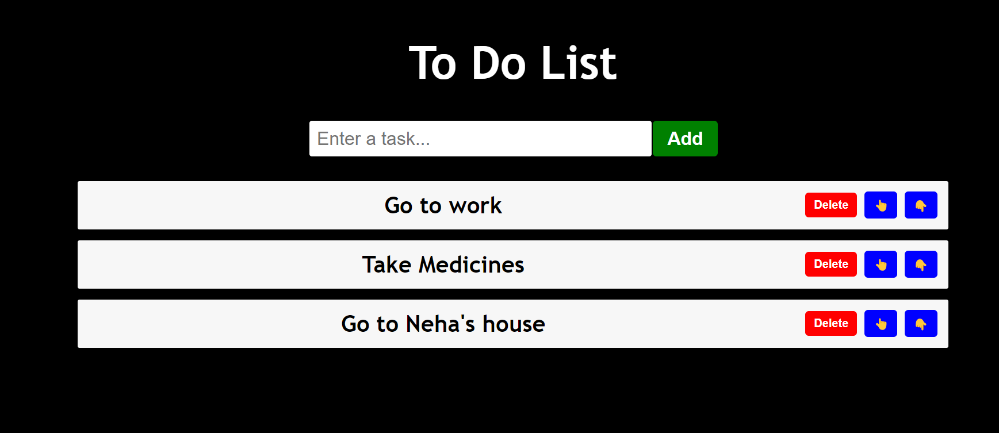

# To-Do App

A simple and intuitive To-Do application built using React.



## Live Demo

Check out the deployed version of the app: [To-Do App](https://66825ca43d9dce08e2cba916--imaginative-panda-82a9b5.netlify.app/)

## Features

- Add new tasks
- Set Priority
- Delete tasks

## Getting Started

To run this project locally, follow these steps:

### Prerequisites

Make sure you have Node.js and npm installed on your machine. You can download Node.js [here](https://nodejs.org/).

### Installation

1. Clone the repository:

2. Navigate to the project directory

3. Install the dependencies:

   ```bash
   npm install
   ```

### Running the App

To start the development server, run:

```bash
npm run dev
```

The app should now be running on [http://localhost:3000](http://localhost:3000).

## Contributing

If you would like to contribute to this project, please fork the repository and create a pull request. We welcome all contributions!
